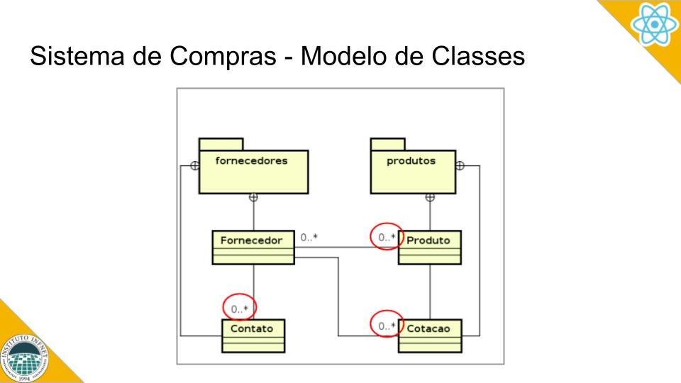

    

# AT - Desenvolvimento Web com React

Construir uma aplicação React que implemente o Sistema de Compras do Infnet, conforme elaborado nas aulas.

**ATENÇÃO:** Não é necessário construir a aplicação completa, mas procure seguir e cumprir os requisitos estabelecidos abaixo. O foco principal é em Fornecedores e Contatos.

A solução deve incluir os seguintes requisitos e critérios de correção:

### 1. Desenvolver aplicações que respondam à eventos com a atualização da interface	

* Modularização do código, separando os métodos de acesso ao banco de dados dos componentes de tela (30%).
* Otimização do handleChange dos campos. Não criar useState para cada campo (60%).
* Implementação do useEffect para as operações de acesso ao Firebase (90%).
* Implementação de links do react-router para montagem do menu de opções (100%)

### 2. Desenvolver componentes usando React Hooks	

* Implementação do Componente de Login e Criação de Conta (30%).
* Implementação dos Componentes com as telas de Fornecedores e Contatos (60%).
* Implementação dos Componentes com as telas de Produtos e Cotações (90%).
* Implementaçã do Componente de Layout para navegação da aplicação (100%).

### 3. Criar formulários web usando componentes ReactJS	

* Implementação da Autenticação e Criação de Conta pelo Firebase (30%).
* Implementação de Inclusão e Listagem de Fornecedores (60%).
* Implementação de Inclusão e Listagem de Contatos (90%).
* Implementação de Exclusão de Fornecedores e Contatos (100%).

### 4. Criar aplicações React com múltiplas páginas usando React Router

* Implementação do Compomente de navegação (menu) e rotas (30%).
* Implementação de menu somente para usuários autenticados (60%).
* Implementação do menu dinâmico conforme o tipo de usuário (90%).
* Implementação de Página Não Encontrada (100%).

Use os esquemas abaixo como referência:

    
  

